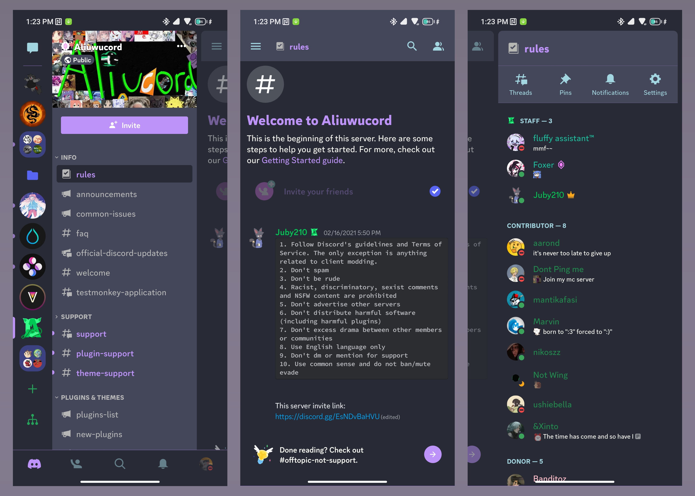
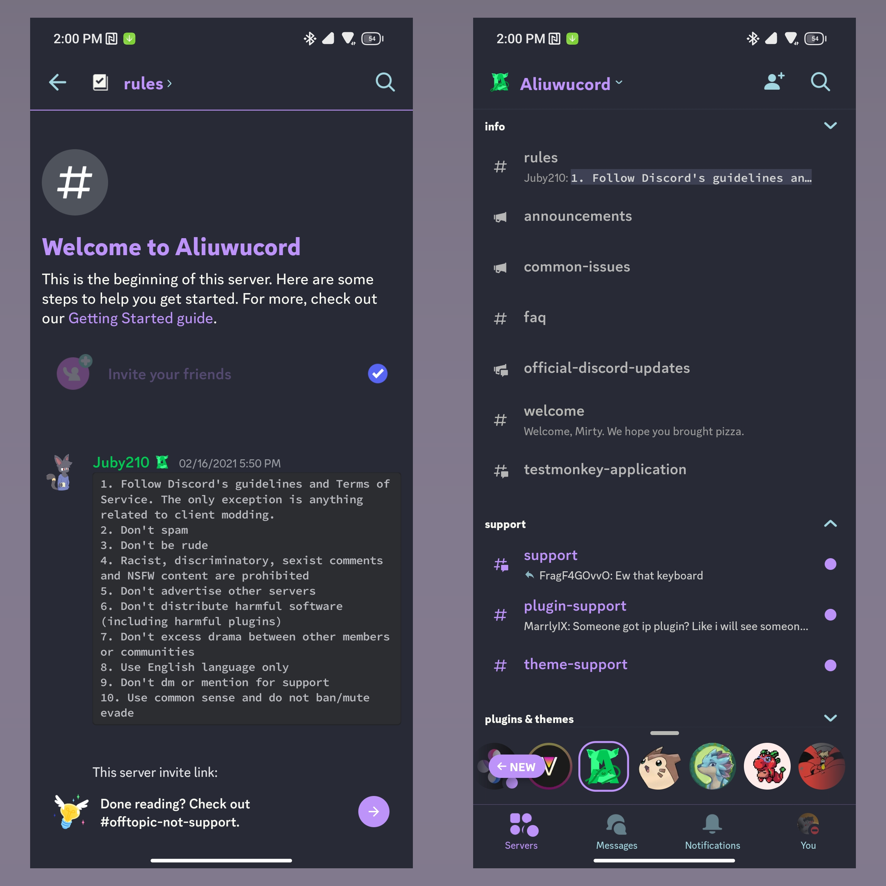

# Dracula theme for DiscordRN mods

This is a theme following the dracula color scheme for Bunny/Pyoncord.
Might not work in older discord versions, WILL not work in Kotlin versions of discord.

This is the work in progress branch, where I go insane, and so do the commit messages.

## Installation

Go to Dracula.json, view as raw, copy the link, then go into your settings in Vendetta, themes and tap the + button, then paste the link if not there already to add it

## Screenshot

Some from TabsV2

